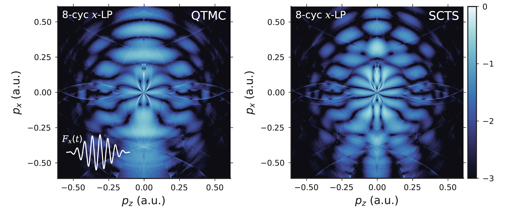

# Example: Short LP Pulses & Phase Methods

This example is adapted from [[*PRA* **94**, 013415 (2016)](https://doi.org/10.1103/PhysRevA.94.013415)], which introduced the initial SCTS model.

When an atom is exposed to an intense linearly-polarized pulse, the atom might absorb photons more than it requires for the electron to ionize, leading to outer ring-like structures in the PMD, which we refer to as the well-known above-threshold ionization (ATI).
The ATI is originally interpreted as excessive absorption of photons in the "multi-photon absorption" picture,
while in the tunneling scenario, the ATI structures also have interpretable physical meanings:
the intercycle interference of electron wave packets which tunneled through the potential barrier at each peak of the laser field.
This allows for reproduction of the ATI structures using the semiclassical trajectory-based methods.

Apart from the ATI rings, the low-energy features of the PMD are also of broad interest, which usually exhibit a fan-like structure.
This structure is contributed mainly by electrons with an angular momentum close to a specific value ``L_0`` and are hence predictable theoretically [^Arbo_2006] [^Arbo_2008].

The following two pieces of code performs a trajectory simulation which employs an 8-cycle and an ultra-short single-cycle linearly-polarized NIR pulse,
with the PMD showing up in the two figures below.
To be faithful to the original work where the ADK initial condition was used with no prefactor included (``\mathcal{P}=1``), we used the ADK-QTMC and ADK-SCTS schemes and set `rate_prefix = :Exp`.
Comparison between the PMD obtained with the QTMC and SCTS phase methods reveals underestimation of the Coulomb interaction's influence on the phase by the QTMC method, which is observed in the number of nodal lines in the low-energy structures.

```julia
# examples/test_8cycs_LP.jl

using eTraj
using eTraj.Targets, eTraj.Lasers, eTraj.Units

l = Cos2Laser(peak_int=90.0TW/cm^2, wave_len=800.0nm, cyc_num=8, ellip=0.0)
t = get_atom("H")

for phase_method in [:QTMC, :SCTS]
    perform_traj_simulation(
        init_cond_method    = :ADK,
        rate_prefix         = :Exp,
        traj_phase_method   = phase_method,
        laser               = l,
        target              = t,
        dimension           = 2,
        sample_t_intv       = (-350,350),
        sample_t_num        = 50000,
        traj_t_final        = 500,
        final_p_max         = (1.0,1.0),
        final_p_num         = (500,500),
        ss_kd_max           = 1.0,
        ss_kd_num           = 20000,
        output_path         = "ADK-$(phase_method)_9e13_800nm_8cyc_LP_ExpRate.jld2"
    )
end
```

```julia
# examples/test_1cyc_LP.jl

using eTraj
using eTraj.Targets, eTraj.Lasers, eTraj.Units

l = Cos2Laser(peak_int=90.0TW/cm^2, wave_len=800.0nm, cyc_num=1, cep=π/2, ellip=0.0)
t = get_atom("H"; soft_core=1e-12)

for phase_method in [:QTMC, :SCTS]
    perform_traj_simulation(
        init_cond_method    = :ADK,
        laser               = l,
        target              = t,
        dimension           = 2,
        sample_t_intv       = (-50,50),
        sample_t_num        = 30000,
        traj_t_final        = 100,
        final_p_max         = (1.0,1.0),
        final_p_num         = (500,500),
        ss_kd_max           = 1.5,
        ss_kd_num           = 10000,
        output_path         = "ADK-$(phase_method)_9e13_800nm_1cyc_LP_ExpRate.jld2",
        traj_phase_method   = phase_method,
        rate_prefix         = :Exp
    )
end
```




[^Arbo_2006]: D. G. Arbó, S. Yoshida, E. Persson, K. I. Dimitriou, and J. Burgdörfer, Interference Oscillations in the Angular Distribution of Laser-Ionized Electrons near Ionization Threshold, *Phys. Rev. Lett.* **96**, 143003 (2006). DOI: [10.1103/PhysRevLett.96.143003](https://doi.org/10.1103/PhysRevLett.96.143003)

[^Arbo_2008]: D. G. Arbó, K. I. Dimitriou, E. Persson, and J. Burgdörfer, Sub-Poissonian angular momentum distribution near threshold in atomic ionization by short laser pulses, *Phys. Rev. A* **78**, 013406 (2008). DOI: [10.1103/PhysRevA.78.013406](https://doi.org/10.1103/PhysRevA.78.013406)
