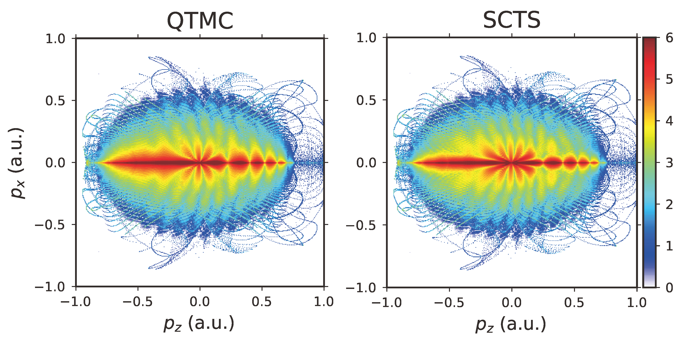

# Example: Phase Methods

To investigate the difference between the phase methods QTMC and SCTS, we use an 8-cycle linearly polarized laser pulse, employing the QTMC and SCTS as the phase methods during the trajectory simulation.

The simulation parameters are brought from [*Phys. Rev. A* **94**, 013415 (2016)] [^ShvetsovShilovski_2016]

[^ShvetsovShilovski_2016]: N. I. Shvetsov-Shilovski *et al.* Semiclassical Two-Step Model for Strong-Field Ionization. *Phys. Rev. A* **94**, 013415 (2016). DOI: [10.1103/PhysRevA.94.013415](https://dx.doi.org/10.1103/PhysRevA.94.013415)

## QTMC Code

```julia
@info "SemiclassicalSFI Example - Phase Methods - QTMC"

@info "Loading Packages..."
using SemiclassicalSFI
using SemiclassicalSFI.Targets
using SemiclassicalSFI.Lasers

t = HAtom()
l = Cos4Laser(peak_int=0.9e14, wave_len=800, cyc_num=8, ellip=0.0)

filename = "SCSFI_H_0.9e14_800nm_8cyc_LP_ADKPara_ExpRate_QTMC.h5"

performSFI(
    target = t,
    laser = l,
    init_cond_method = :ADK,
    adk_tun_exit = :Para,
    sample_t_intv = (-300,300),
    sample_t_num = 50000,
    sample_cutoff_limit = 1e-16,
    ss_kd_max = 1.0,
    ss_kd_num = 400,
    ss_kz_max = 1.0,
    ss_kz_num = 400,
    rate_prefix = :ExpRate,
    traj_phase_method = :QTMC,
    traj_t_final = 450,
    traj_rtol = 1e-6,
    save_3D_spec = true,
    final_p_max = (1,1,1),
    final_p_num = (400,400,400),
    save_path = filename
    )
```

## SCTS Code

```julia
@info "SemiclassicalSFI Example - Phase Methods - SCTS"

@info "Loading Packages..."
using SemiclassicalSFI
using SemiclassicalSFI.Targets
using SemiclassicalSFI.Lasers

t = HAtom()
l = Cos4Laser(peak_int=0.9e14, wave_len=800, cyc_num=8, ellip=0.0)

filename = "SCSFI_H_0.9e14_800nm_8cyc_LP_ADKPara_ExpRate_SCTS.h5"

performSFI(
    target = t,
    laser = l,
    init_cond_method = :ADK,
    adk_tun_exit = :Para,
    sample_t_intv = (-300,300),
    sample_t_num = 50000,
    sample_cutoff_limit = 1e-16,
    ss_kd_max = 1.0,
    ss_kd_num = 400,
    ss_kz_max = 1.0,
    ss_kz_num = 400,
    rate_prefix = :ExpRate,
    traj_phase_method = :SCTS,
    traj_t_final = 450,
    traj_rtol = 1e-6,
    save_3D_spec = true,
    final_p_max = (1,1,1),
    final_p_num = (400,400,400),
    save_path = filename
    )
```

Each piece of code takes 8.5 hours using 4 threads on an AMD Ryzen 9 7950X CPU at Manjaro Linux (Uranos 23.0.0).

!!! note "Note"
    -  This example takes a very long time (~10h each task for 4 threads) to finish.
    -  In this example, the 3D momentum spectrum is collected, which is very memory-consuming, consider using fewer threads.
    -  A 16-thread task is much less efficient than a 4-thread task and consumes much more memory. Therefore, it's suggested to use fewer threads (e.g., 4) per task.

The final momentum spectrum (the slice on the ``p_z-p_x`` plane near ``p_y=0``) is displayed below.
