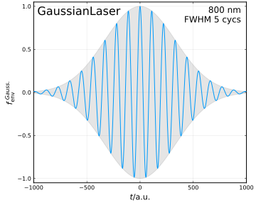
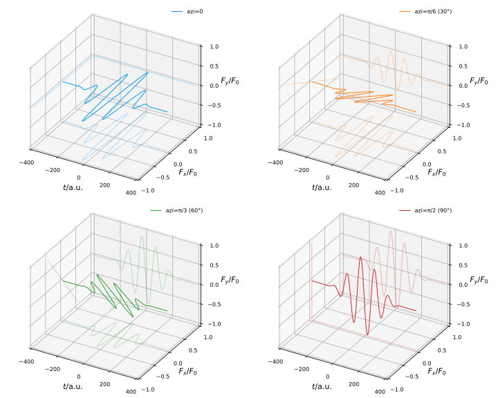

# [Manual: The `Lasers` Module](@id lasers_doc)

```@docs
Lasers
Laser
```

```@contents
Pages = ["manual1_lasers.md"]
Depth = 3
```

---------------------------

## The Monochromatic Lasers

```@docs
MonochromaticLaser
```

A typical monochromatic laser is composed of the carrier wave ``\cos (\omega t+\phi)`` and the envelope function ``f_{\rm{env}}(t)`` (which is assumed to have a peak amplitude of 1).
Given the amplitude of the vector potential ``A_0``, the time-dependent vector potential of the laser, which we assume to propagate in ``z`` direction and have ``x`` axis as the principle axis of polarization, reads
```math
\begin{equation}
    \AA(t) = A_0 f_{\rm{env}}(t) [ \cos(\omega t+\phi)\hat{\bm{x}} + \varepsilon \sin(\omega t+\phi) \hat{\bm{y}} ],
\end{equation}
```
with ``\omega`` the laser angular frequency, ``\phi`` the carrier-envelope phase (CEP) and ``\varepsilon`` the ellipticity.

In the [`Lasers`](@ref) module there are some available monochromatic laser objects implemented for use, namely [`Cos4Laser`](@ref), [`Cos2Laser`](@ref) and [`GaussianLaser`](@ref),
which differ from each other in their envelope functions ``f_{\rm{env}}(t)``, and they are all subtypes of the [`MonochromaticLaser`](@ref) base type.

---------------------------

### `Cos4Laser`

The [`Cos4Laser`](@ref)'s vector potential has a ``\cos^4``-shaped envelope function:
```math
\begin{equation}
    f_{\rm{env}}^{\rm{cos4}} =
    \begin{dcases}
        \ \cos^4 \left(\frac{\omega(t-t_0)}{2N}\right), & -NT/2 \leq t-t_0 \leq NT/2, \\
        \ 0, & \rm{otherwise},
    \end{dcases}
\end{equation}
```
where ``N`` is the total cycle number, ``T=2\pi/\omega`` is the period and ``t_0`` the peak time.

```@docs
Cos4Laser
Cos4Laser()
```


---------------------------

### `Cos2Laser`

The [`Cos2Laser`](@ref) has a ``\cos^2``-shaped envelope function, similar to that of the [`Cos4Laser`](@ref):
```math
\begin{equation}
    f_{\rm{env}}^{\rm{cos2}} =
    \begin{dcases}
        \ \cos^2 \left(\frac{\omega(t-t_0)}{2N}\right), & -NT/2 \leq t-t_0 \leq NT/2, \\
        \ 0, & \rm{otherwise}.
    \end{dcases}
\end{equation}
```

```@docs
Cos2Laser
Cos2Laser()
```


---------------------------

### `GaussianLaser`

The [`GaussianLaser`](@ref) has a Gaussian-shaped envelope function, which is the most commonly used:
```math
\begin{equation}
    f_{\rm{env}}^{\rm{Gauss.}} = \ee^{-(t-t_0)^2/2\tau_\sigma^2} = \ee^{- \ln{2}~\cdot~(t-t_0)^2/\tau_{\rm{FWHM}}^2},
\end{equation}
```
where ``\tau_\sigma`` is the half temporal width of the laser and ``\tau_{\rm{FWHM}}=2\sqrt{\ln{2}}\ \tau_\sigma`` denotes the laser's intensity profile's temporal FWHM (full-width at half maxima).

```@docs
GaussianLaser
GaussianLaser()
```



---------------------------

## `BichromaticLaser`

Apart from monochromatic lasers, the [`BichromaticLaser`](@ref) which combines two [`MonochromaticLaser`](@ref) is also implemented.

```@docs
BichromaticLaser
BichromaticLaser()
```

---------------------------

## Available Properties

The available properties of the laser fields are listed below.
The "·" sign indicates that the property is available due to inheritance from the supertype.

To obtain a property of the laser field, invoke the property as a method and pass the laser object as an argument. The following shows an example:

```@repl
using eTraj.Lasers
l = Cos4Laser(peak_int=1e14, wave_len=800.0, cyc_num=10, ellip=0)
LaserA0(l)
Ax = LaserAx(l)
Ax(0.0)
```

|                | [`Laser`](@ref) | [`MonochromaticLaser`](@ref) |[`Cos4Laser`](@ref) | [`Cos2Laser`](@ref) | [`GaussianLaser`](@ref) | [`BichromaticLaser`](@ref) |
|:---------------|:-:|:-:|:-:|:-:|:-:|:-:|
|`LaserFx`         | ✔ | · | · | · | · | · |
|`LaserFy`         | ✔ | · | · | · | · | · |
|`LaserAx`         | ✔ | · | · | · | · | · |
|`LaserAy`         | ✔ | · | · | · | · | · |
|`PeakInt`         |   | ✔ | · | · | · |   |
|`WaveLen`         |   | ✔ | · | · | · |   |
|`CycNum`          |   |   | ✔ | ✔ |   |   |
|`SpreadCycNum`    |   |   |   |   | ✔ |   |
|`SpreadDuration`  |   |   |   |   | ✔ |   |
|`FWHM_Duration`   |   |   |   |   | ✔ |   |
|`Ellipticity`     |   | ✔ | · | · | · |   |
|`Azimuth`         |   | ✔ | · | · | · |   |
|`AngFreq`         |   | ✔ | · | · | · |   |
|`Period`          |   | ✔ | · | · | · |   |
|`CEP`             |   | ✔ | · | · | · |   |
|`LaserF0`         |   | ✔ | · | · | · |   |
|`LaserA0`         |   | ✔ | · | · | · |   |
|`UnitEnvelope`    |   | ✔ | · | · | · |   |
|`KeldyshParameter`|   | ✔ | · | · | · |   |
|`TimeShift`       |   |   | ✔ | ✔ | ✔ |   |
|`Laser1`          |   |   |   |   |   | ✔ |
|`Laser2`          |   |   |   |   |   | ✔ |
|`Delay21`         |   |   |   |   |   | ✔ |


### Ellipticity

The ellipticity ``\varepsilon`` defines the polarization type of the laser field.
For special cases, `0` indicates linear polarization and `±1` indicates circular polarization.
The electric field rotates clockwise for positive ellipticities and counter-clockwise for negative ones.


### Azimuth of Principle Axis

The azimuth angle ``\varphi`` of the principle axis defines a clockwise rotation of the laser field in the polarization plane.




### Carrier-Envelope-Phase (CEP)

The carrier-envelope-phase (CEP) ``\phi`` is the difference between the optical phase of the carrier wave and the envelope position.
For few-cycle laser pulses, the influence of the CEP to the laser-matter interaction becomes significant.


### List of Property Documentations

```@docs
LaserFx
LaserFy
LaserAx
LaserAy
PeakInt
WaveLen
CycNum
SpreadCycNum
SpreadDuration
FWHM_Duration
Ellipticity
Azimuth
AngFreq
Period
CEP
LaserF0
LaserA0
UnitEnvelope
KeldyshParameter
TimeShift
Laser1
Laser2
Delay21
```
